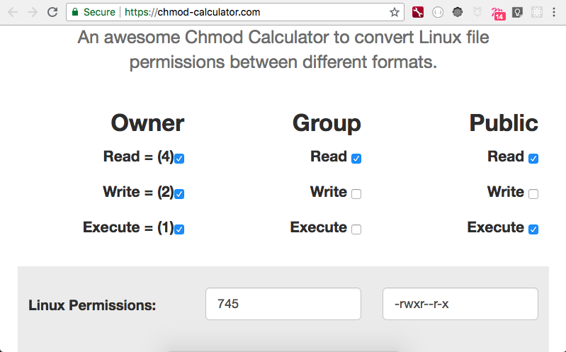

Log in as root: `sudo su`

root directory: `/`
root user: the user named root (the batal 💪🏻)
home directory: the home directory for each user, `/home/<username>` and `/root` for root user


Session 2
==========

`/` the root file system
two types of `path`

 ### absolute path
  - `/`
  - `/home/ahmad`
  - `/var/log/apache.log`
  - `/Users/ahmad/Documents/MyResume.pdf`

 ### relative path
  - `games`
  - `games/gta2`
  - `../pictures`
  - `../../games/gta2`


```sh
pwd = /
cd videos/YouTube

pwd = /videos
cd ../pictures

pwd = /pictures/promotions/2016/Q1 target= /pictures/summer
cd ../../../summer

 /
 |--- games
 |--- documents
 |--- videos
 |------ YouTube
 |------ Family
 |--- pictures
 |------ summer
 |------ winter
 |------ promotions
 |--------- 2016
 |------------ Q1
 |------------ Q2
 |--------- 2017
 |------------ Q1
 |------------ Q2
 |--------- 2018
 |------------ Q1
 |------------ Q2

 ```

### Creating Directories

```sh
mkdir <path of the directory>

pwd = /home/ahmad
mkdir games
mkdir ../games
```

`/home/ahmad/` + `games` = `/home/ahmad/games`
`/home/ahmad/` + `../games` = `/home/ahmad/../games` = `/home/games`

### Removing Directories
```sh
rmdir <path of the directory>

pwd = /home/ahmad
rmdir games
rmdir /


### Quick Lab

invoices
|____ 2016
        |___ Q1
        |___ Q2
        |___ Q3
|____ 2017
        |___ Q1
        |___ Q2
|____ 2018
        |___ Q1
        |___ Q2
|____ 2019
        |___ Q1


## listing of the directory

```sh
ls <path of the directory?> default to pwd
```

- -a to show hidden files
- -l long listing
- -h human readable


### Permissions

check this link [https://chmod-calculator.com/](Linux Permissions Calculator)



```sh
   user     group       other
-  ---       ---         ---
d  r w x    r w x
-  - - -    - - -
```

```
d rwx      rw-   ---
```